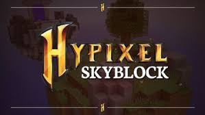
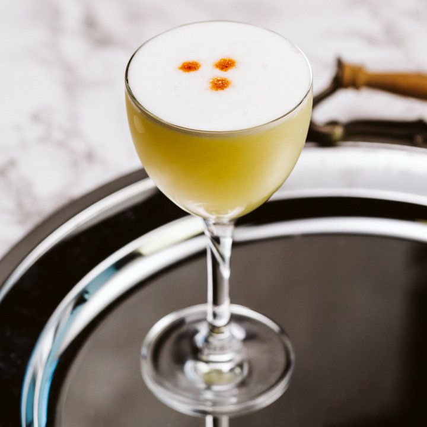

# 👋 Hi, I'm David Hu

The what is to build a product that matters. The how is with software. The why is a fight everyday to leave behind something with meaning.

---

## 🧠 About Me

- 🎓 Computer Science Bachelor's Student at [The University of Virginia](https://www.usnews.com/best-colleges/uva-6968)
  - HS Diploma from [Thomas Jefferson School of Science and Technology](https://www.usnews.com/education/best-high-schools/virginia/districts/fairfax-county-public-schools/thomas-jefferson-high-school-for-science-and-technology-20461) (TJHSST)
- 💼 Currently interning at CapitalOne
- 🌱 Exploring: Full Stack Web Development w/ Angela Yu, Cybersecurity w/ CompTIAA+, Getting AWS certified (practicioner)
- 🛠️ Interested in: fintech, ML infrastructure, Web hosting

---

## 🧰 Tools & Technologies

| Category       | Stack |
|----------------|-------|
| Languages      | Python, Java, TypeScript, SQL, C |
| Frontend       | React, HTML/CSS, JavaScript, Bootstrap |
| Backend        | Django, Flask, Springboot |
| Data/Infra     | PostgreSQL w/ DBeaver, AWS (S3, Lambda, RDS, Sagemaker)|
| Dev Workflow   | GitHub Actions, VSCode, Cloudwatch |

<!-- badge summary -->

  <!-- Languages -->
  
  
  
  
  

   

  <!-- Frontend -->
  
  
  
  
  

   

  <!-- Backend -->
  
  
  

   

  <!-- Data/Infra -->
  
  
  
  

   

  <!-- Dev Workflow -->
  
  
  

---

## 🚀 Projects & Work

### 🔷 [Web Dev Bootcamp](https://github.com/dhu2022-dev/web-dev-bootcamp)
Curated list of projects learning full stack web development from Dr. Angela Yu's UDemy course.
<!-- Short description of what it does, the tools used, and why it matters. -->

### 🔷 [JP Morgan Chase Software Engineering Job Simulation](https://github.com/dhu2022-dev/job-simulations)
Bite-sized projects designed by JPMC SWEs w/ Forage to simulate job tasks as a JPMC SWE.
<!-- If this was part of a team/client engagement, note your role briefly. -->

<!-- ### 🔷 [Cool Side Project](#) -->
<!-- Was it fun, technically difficult, or used something unusual? Say that. -->

---

<!-- ## 📺 What to Expect from My Work

> Optional GIF demo, screenshot, or quote about your philosophy  
> e.g. "Clean, modular, documented code. Functional and honest UI."

  

--- -->

## 📫 How to Reach Me

<!-- - 🌐 [Portfolio](#) -->
- 📄 [Resume](Resume_Financial.pdf)
- 💼 [LinkedIn](https://www.linkedin.com/in/davidhu426/)
- 📬 [Email](who.is.david101@gmail.com)

---

_Thanks for stopping by. If you’ve scrolled this far, you might as well check out one of the projects above._ 👀

---

## 💭 Outside of Work

### 🧑‍💻 Hackathons & Friends

I LOVE Hackathons! Me and (sometimes the bois) chugging redbull to pump out a hopelessly unrealistic idea in less than 48 hours:

  

Let's connect! I enjoy meeting new people. I'm in a social fraternity while at college (proud [PSK](https://phisigmakappa.org/about/) Brother) and made some of my best friends by taking a risk.  
Some of my best projects were at other schools done w/ people I hadn't met before. One good way to really know a person is to see how they perform in the middle of the night with only hours to spare.  
Learned explitives in new languages then lol.

  

---

### 🧧 Culture & Language

I'm fluent in Mandarin to the point where I've interned to edit videos for [China State Television's Education channel (CETV)](https://en.wikipedia.org/wiki/China_Education_Television).  
My grandma did a good job teaching me how not to be a banana. Not a security risk though; proud US citizen and bg check should turn up clean.

  
  
  

---

### 📸 Photography

I enjoy portrait photography (though I admit I'm not very good).  
I share a [patent](https://patents.justia.com/patent/11086197) in Portrait Photography. I also help my Dad out at his studio (link coming soon), where he makes money taking portraits as a side hustle outside of work.

<!-- Replace below with photos if available -->

---

### 🎮 Gaming

Pretty big on gaming. Select games though: Minecraft (Hypixel Skyblock especially), League of Legends, and Clash of Clans.  
Fun fact: I moderate [TFBlade's](https://www.twitch.tv/tfblade) channel, a League of Legends Twitch streamer with 1M+ followers (ask me how I ended up there!) and get paid in Riot Points (RP).  
I don't type and I just do it mainly during mealtime. My sister says this is negative rizz and the only way I redeem it is to giveaway the RP I've earned to a willing ABG (any takers?!).

  
  
  

---

### 🍜 Food & Drinks

HUGE foodie! Know a good place in your area? Message me! I like trying new things. I also cook at home and college.  
Favorite dishes to make include: Red Braised Pork (红烧肉), Black Bean Paste Noodles (炸酱面), Steak (Medium rare; from the grill w/ mashed potatoes and asparagus. Every guy needs to know).  
Beverage of choice: Pisco Sour or Suntory Whiskey although I won't say no to Pina Coladas on the beach.

**Dishes:**  

  
  
  

**Drinks:**  

  
  
  

---

### 🏃‍♂️ Fitness

I also enjoy playing tennis, running, and going to the gym.  
<!-- Replace these with real images if possible -->

  
  
  

---

### 📚 Favorite Books

Legend of the Condor Heroes, Extreme Ownership, Ranger's Apprentice.

  
  
  

---
